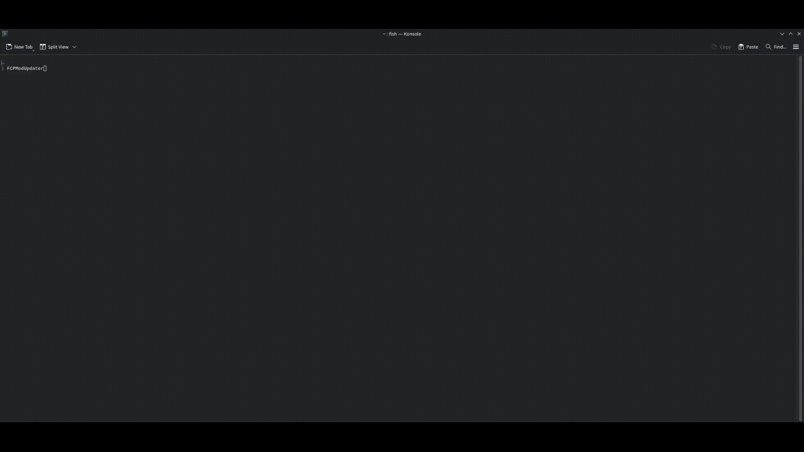

<h1 align="center">FCP Mod Updater</h1>

<p align="center">
  
</p>

<p align="center">
  <strong>A CLI tool for managing Fallout Collaboration Project RimWorld mods.</strong>
</p>

<p align="center">
  Discover, install, update, and manage FCP mods with an interactive terminal UI or automated workflows.
</p>

<p align="center">
  <a href="https://github.com/FalloutCollaborationProject/FCP-Mod-Updater/releases/latest">
    
  </a>
  <a href="https://github.com/FalloutCollaborationProject/FCP-Mod-Updater/releases">
    
  </a>
  <a href="https://discord.gg/XcgBf3AbPa">
    
  </a>
</p>

<p align="center">
  <a href="https://github.com/FalloutCollaborationProject/FCP-Mod-Updater/stargazers">
    
  </a>
  <a href="https://github.com/FalloutCollaborationProject/FCP-Mod-Updater/releases">
    
  </a>
  <!-- <a href="LICENSE">
    
  </a> -->
  <a href="https://github.com/FalloutCollaborationProject/FCP-Mod-Updater/actions/workflows/ci.yml">
    
  </a>
</p>

<p align="center">
  
</p>

## Features

- **Auto-discover** RimWorld installation across Steam, GOG, and Lutris on Windows, Linux, and macOS
- **Interactive mode** with rich terminal UI for browsing, updating, and managing mods
- **Batch update mode** for automation scripts
- **Install new mods** directly from the FCP GitHub organization
- **Convert local mods** (ZIP downloads) to Git repositories for easy updates
- **Branch/commit switching** for testing specific mod versions
- **Status overview** showing update availability, local changes, and sync state

## Requirements

- [Git](https://git-scm.com/downloads) installed and available in PATH

## Installation

### Standard Installation

> [!NOTE]
> Your anti-virus may flag the download as suspicious/malicious, this is due to the code being unsigned. To remedy this would cost us real money and not a small amount either, you may check on [VirusTotal](https://www.virustotal.com/gui/) or [build from source.](#build-from-source)

> [!TIP]
> **Not sure which file to download?** Grab the **self-contained** version for your platform — it includes everything you need and just works, no extra software required outside of Git.

| Archive | What it means | Who it's for |
|---------|---------------|--------------|
| `*-selfcontained.zip` (Windows) | Everything bundled in one package | **Most users** — download this one |
| `*-selfcontained.tar.gz` (Linux) | Everything bundled in one package | **Most users** — download this one |
| `*-win-x64.zip` / `*-linux-x64.tar.gz` | Smaller download, but requires [.NET 10 Runtime](https://dotnet.microsoft.com/download) installed separately | Developers or users who already have .NET installed |

Downloads are available on the [Releases](https://github.com/FalloutCollaborationProject/FCP-Mod-Updater/releases) page.


### Build from Source
```bash
git clone https://github.com/FalloutCollaborationProject/FCPModUpdater.git
cd FCPModUpdater
dotnet build
```

## Usage

### Quick Start

1. Download the **self-contained** zip/tar for your platform from [Releases](https://github.com/FalloutCollaborationProject/FCP-Mod-Updater/releases)
2. Extract the archive anywhere on your computer
3. **Windows:** Double-click `FCPModUpdater.exe` — the tool will automatically find your RimWorld installation
4. **Linux/macOS:** Run `./FCPModUpdater` from a terminal, ensuring it has execution permission.

The tool opens an interactive menu — use the **arrow keys** to navigate, **Enter** to select, and **Escape** to go back.

### To install mods:
1. Select **Install New Mods** from the main menu
2. Use **arrow keys** to browse available mod, press **Space** to mark/unmark each one
3. Press **Enter** to confirm and install the selected mods

### To update mods:
1. Select **Update Mods** from the main menu
2. All mods with available updates are pre-selected, press **Space** to deselect any you want to skip
3. Press **Enter** to confirm and apply updates

### To uninstall mods:
1. Select **Uninstall Mods** from the main menu
2. Use **arrow keys** to browse installed mods, press **Space** to mark each one for removal
3. Press **Enter**, confirm the warning prompt, then type `DELETE` to permanently remove the selected mods

### To convert a local (ZIP) mod to a Git repository:
1. Select **Convert to Git** from the main menu
2. Press **Space** to select any local mods that match FCP repositories
3. Press **Enter** and confirm, the folder will be replaced with a fresh git clone

### To switch a mod's branch or version:
1. Select **Switch Version** from the main menu
2. Choose the mod you want to manage
3. Select **Switch Branch** to pick a branch, or **Checkout Specific Commit** to pin to a specific version

### To Batch Update Mods

```bash
FCPModUpdater update
```

Non-interactive mode that updates all FCP mods with available changes. Returns exit code 0 on success, 1 if any updates fail.

## Options

### Choosing a Directory

Both commands accept:
- `-d, --directory <path>` — Path to RimWorld Mods folder (auto-discovers if omitted)

```bash
FCPModUpdater scan --directory "/path/to/RimWorld/Mods"
FCPModUpdater update -d "C:\Games\RimWorld\Mods"
```

## Environment Variables

| Variable | Description |
|----------|-------------|
| `GITHUB_TOKEN` | Optional. GitHub personal access token to increase API rate limit from 60 to 5000 requests/hour |

## How Mods Are Identified

FCP mods are identified by:
1. Git remote URL containing `github.com/FalloutCollaborationProject/`
2. Folder name matching an FCP repository (supports ZIP downloads with branch suffixes like `-main`)

Only repositories tagged with the `rimworld-mod` topic are included.

## Status Icons

| Icon | Status | Description |
|------|--------|-------------|
| ✓ | Up to Date | No updates available |
| ↓ | Behind | Updates available |
| ↑ | Ahead | Local commits not on remote |
| ⇅ | Diverged | Both behind and ahead |
| ~ | Modified | Has uncommitted local changes |
| — | Not Git | Local folder (not a git repo) |
| ✗ | Error | Git operation failed |
